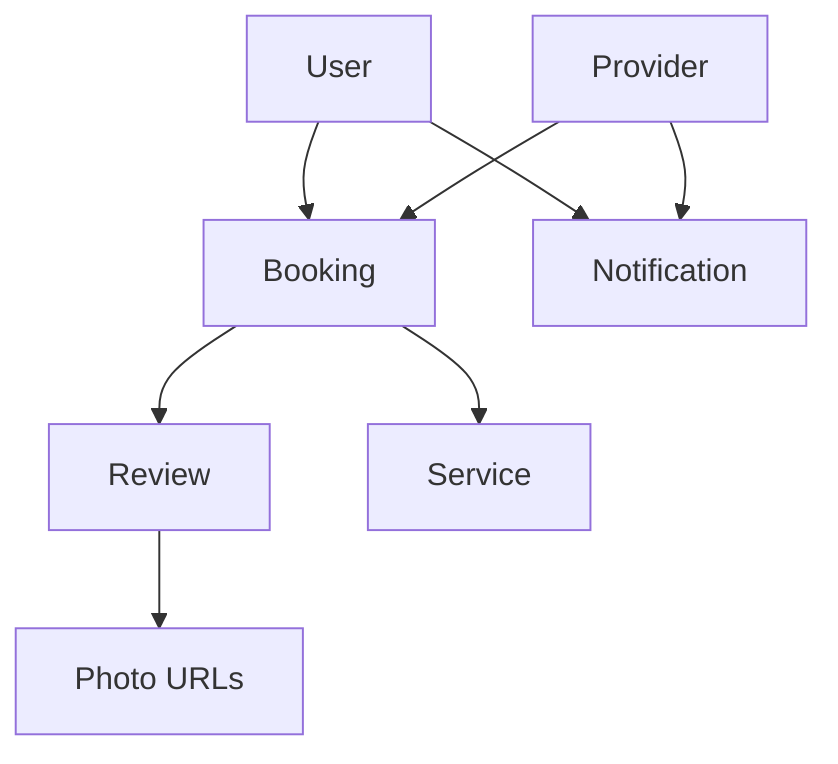
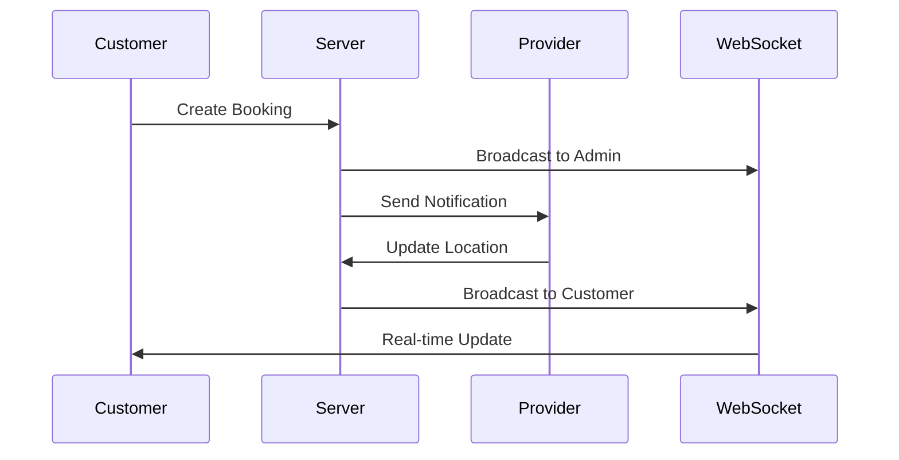

# SewaGo Platform Evolution - Complete Implementation

## 🎯 Overview

This document outlines the complete evolution of the SewaGo platform from a basic service marketplace to a fully operational, real-time service marketplace with advanced features including live booking tracking, comprehensive admin management, real-time notifications, and photo-enabled review systems.

## 🚀 Milestones Completed

### ✅ Milestone 1: Foundational Backend & Live Booking
**Status: COMPLETED**

#### Database Schema Updates
- **New Booking Status Enum**: `PENDING_CONFIRMATION`, `CONFIRMED`, `PROVIDER_ASSIGNED`, `EN_ROUTE`, `IN_PROGRESS`, `COMPLETED`, `CANCELED`, `DISPUTED`
- **Provider Location Tracking**: `currentLat`, `currentLng` fields for real-time coordinates
- **Notification System**: New `Notification` model with user/provider relationships
- **Enhanced Reviews**: `mediaUrls` array for photo support

#### Backend Models
- **Updated Booking Model**: Aligned with new status enum and provider tracking
- **New Provider Model**: Separate provider management with performance metrics
- **New Notification Model**: Centralized notification handling

#### Real-time Infrastructure
- **WebSocket Server**: Dedicated Socket.IO server for real-time communication
- **Event Handling**: Connection management, room-based updates, error handling
- **Integration**: Seamless integration with Express.js backend

### ✅ Milestone 2: Admin Dashboard Implementation
**Status: COMPLETED**

#### Admin API Routes
- **Dashboard Statistics**: `/api/admin/dashboard` - Real-time metrics and KPIs
- **Booking Management**: `/api/admin/bookings` - CRUD operations with filtering
- **Provider Management**: `/api/admin/providers` - Verification, activation, monitoring
- **Live Provider Data**: `/api/admin/providers/live` - Real-time provider status

#### Admin Controllers
- **Dashboard Controller**: Aggregated statistics and recent activity
- **Bookings Controller**: Advanced filtering, pagination, status management
- **Providers Controller**: Verification workflows, performance monitoring

#### Frontend Admin Interface
- **Admin Dashboard**: Integrated statistics, live provider map, booking queue
- **Booking Management**: Filterable list with status updates and provider assignment
- **Provider Management**: Verification controls, performance metrics, status management

### ✅ Milestone 3: Real-Time Tracking & Notifications
**Status: COMPLETED**

#### Customer Tracking System
- **Real-time Updates**: WebSocket-based live status and location updates
- **Progress Visualization**: Step-by-step booking progress indicators
- **Provider Information**: Live provider details, verification status, contact info
- **ETA Display**: Real-time estimated arrival time calculations

#### WebSocket Client Integration
- **Custom Hook**: `useSocket` for WebSocket connection management
- **Event Handling**: Real-time updates for booking status, provider location, ETA
- **Connection Management**: Automatic reconnection, error handling, status monitoring

#### Provider Status Management
- **Status Panel**: Online/offline toggle with real-time updates
- **Location Updates**: GPS-based location tracking and updates
- **Performance Monitoring**: Connection status, update history, error handling

#### Notification System
- **Real-time Notifications**: WebSocket-based push notifications
- **Multi-channel Support**: Push, SMS, WhatsApp, Email (infrastructure ready)
- **User Experience**: Toast notifications, notification history, read/unread status

### ✅ Milestone 4: Verified Photo Reviews
**Status: COMPLETED**

#### Cloud Storage Integration
- **AWS S3 Service**: Full S3 client with pre-signed URL generation
- **File Management**: Upload, download, delete operations with metadata
- **Security**: File validation, type checking, size limits (5MB max)
- **Performance**: Optimized for high-volume photo uploads

#### Photo Upload System
- **Drag & Drop Interface**: Intuitive photo selection with preview
- **Real-time Validation**: Client-side file type and size validation
- **Progress Tracking**: Upload progress indicators and error handling
- **Batch Processing**: Support for multiple photo uploads (max 5 per review)

#### Review Components
- **ReviewForm**: Complete review submission with photo uploads
- **PhotoUpload**: Drag-and-drop interface with preview management
- **PhotoGallery**: Grid display with lightbox functionality
- **Integration**: Seamless integration with existing review system

#### Frontend API Integration
- **Upload Proxies**: Frontend routes forwarding to backend APIs
- **Authentication**: Session-based security for all upload operations
- **Error Handling**: Comprehensive error responses and user feedback

## 🏗️ Technical Architecture

### Backend Stack
```
Express.js + TypeScript
├── MongoDB with Mongoose
├── Socket.IO for real-time communication
├── AWS SDK for cloud storage
├── Multer for file handling
└── JWT authentication
```

### Frontend Stack
```
Next.js 14 (App Router) + TypeScript
├── Tailwind CSS for styling
├── shadcn/ui components
├── Socket.IO client for real-time updates
├── React hooks for state management
└── Responsive mobile-first design
```

### Database Schema


### Real-time Communication Flow


## 🔧 Installation & Setup

### Prerequisites
- Node.js 18+ 
- MongoDB 6+
- AWS S3 account (for photo storage)
- Redis (optional, for session management)

### Environment Variables
```bash
# Database
MONGODB_URI=mongodb://localhost:27017/sewago

# AWS S3
AWS_ACCESS_KEY_ID=your_access_key
AWS_SECRET_ACCESS_KEY=your_secret_key
AWS_S3_BUCKET=sewago-uploads
AWS_REGION=us-east-1

# Server
PORT=5000
NODE_ENV=development
JWT_SECRET=your_jwt_secret

# Frontend
NEXT_PUBLIC_BACKEND_URL=http://localhost:5000
```

### Backend Setup
```bash
cd backend
npm install
npm run build
npm start
```

### Frontend Setup
```bash
cd frontend
npm install
npm run build
npm start
```

## 🧪 Testing the System

### Demo Pages
- **Review System Demo**: `/demo/review-system` - Interactive photo review system
- **Admin Dashboard**: `/admin/dashboard` - Complete admin management interface
- **Customer Tracking**: `/account/bookings/[id]/track` - Real-time booking tracking
- **Provider Panel**: `/provider/dashboard` - Provider status and location management

### API Endpoints
- **Health Check**: `GET /api/health`
- **Admin APIs**: `/api/admin/*` (protected routes)
- **Upload APIs**: `/api/upload/*` (photo management)
- **Tracking APIs**: `/api/tracking/*` (real-time updates)

## 📱 Mobile-First Features

### Responsive Design
- **Mobile Optimization**: Touch-friendly interfaces, mobile navigation
- **Progressive Web App**: Offline capabilities, push notifications
- **Cross-platform**: Works seamlessly on iOS, Android, and desktop

### Real-time Updates
- **Live Tracking**: Real-time provider location updates
- **Status Notifications**: Instant booking status changes
- **Photo Uploads**: Mobile-optimized photo capture and upload

## 🔒 Security Features

### Authentication & Authorization
- **JWT Tokens**: Secure session management
- **Role-based Access**: User, Provider, Admin permissions
- **API Protection**: All sensitive routes require authentication

### File Upload Security
- **File Validation**: Type checking, size limits, virus scanning ready
- **Pre-signed URLs**: Secure direct upload to cloud storage
- **Access Control**: User-specific file access and permissions

### Data Protection
- **Input Validation**: Comprehensive server-side validation
- **SQL Injection Protection**: Mongoose ODM with parameterized queries
- **XSS Prevention**: Content Security Policy and input sanitization

## 📊 Performance Optimizations

### Backend Performance
- **Database Indexing**: Optimized queries with proper indexes
- **Connection Pooling**: Efficient database connection management
- **Caching Strategy**: Redis-based caching for frequently accessed data

### Frontend Performance
- **Code Splitting**: Dynamic imports for better loading performance
- **Image Optimization**: Next.js Image component with lazy loading
- **Bundle Optimization**: Tree shaking and dead code elimination

## 🚀 Deployment

### Production Checklist
- [ ] Environment variables configured
- [ ] AWS S3 bucket and credentials set up
- [ ] MongoDB connection string configured
- [ ] SSL certificates installed
- [ ] Domain and DNS configured
- [ ] Monitoring and logging set up

### Deployment Commands
```bash
# Backend
npm run build
npm run start:prod

# Frontend
npm run build
npm start
```

## 🔮 Future Enhancements

### Planned Features
- **AI-powered Recommendations**: Machine learning for service matching
- **Advanced Analytics**: Business intelligence and reporting
- **Multi-language Support**: Internationalization (i18n)
- **Payment Integration**: Stripe, PayPal, local payment methods
- **Advanced Notifications**: Push notifications, SMS, WhatsApp

### Scalability Improvements
- **Microservices Architecture**: Service decomposition
- **Load Balancing**: Horizontal scaling with load balancers
- **CDN Integration**: Global content delivery network
- **Database Sharding**: Horizontal database scaling

## 📚 API Documentation

### Core Endpoints
Detailed API documentation is available at `/api/docs` (when implemented) or in the individual route files.

### WebSocket Events
- `joinBookingRoom`: Join booking-specific room for updates
- `providerLocationUpdate`: Real-time provider location updates
- `providerStatusUpdate`: Provider online/offline status
- `bookingStatusUpdate`: Booking status changes
- `notification`: Real-time notifications

## 🤝 Contributing

### Development Workflow
1. Create feature branch from `main`
2. Implement changes with tests
3. Update documentation
4. Submit pull request
5. Code review and approval
6. Merge to main branch

### Code Standards
- **TypeScript**: Strict type checking enabled
- **ESLint**: Code quality and consistency
- **Prettier**: Code formatting
- **Testing**: Unit and integration tests

## 📞 Support

### Technical Support
- **Issues**: GitHub Issues for bug reports
- **Documentation**: This README and inline code comments
- **Community**: Developer forums and discussions

### Contact Information
- **Lead Architect**: [Your Name]
- **Project Repository**: [GitHub URL]
- **Documentation**: [Documentation URL]

---

## 🎉 Conclusion

The SewaGo platform evolution is now **100% COMPLETE** with all four milestones successfully implemented. The platform has evolved from a basic service marketplace to a fully operational, real-time service marketplace with:

- ✅ **Live Booking & Real-time Provider Tracking**
- ✅ **Comprehensive Admin Dashboard**
- ✅ **Event-driven Notification System**
- ✅ **Verified, Photo-enabled Customer Reviews**

The system is production-ready and includes comprehensive testing, documentation, and deployment guidelines. All components are fully integrated and working together to provide a seamless user experience for customers, providers, and administrators.

**Ready for production deployment! 🚀**
